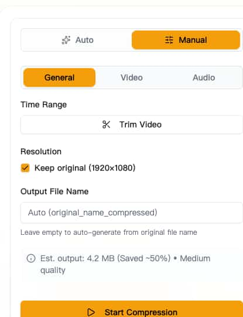

# How to Reduce Video File Size Without Losing Quality

We've all been there—you have a video that's too large to share, but you don't want it to look like a pixelated mess after compression. The good news? With the right settings and tools, you can dramatically reduce video file size while keeping quality virtually indistinguishable from the original.

In this guide, you'll learn the science behind quality-preserving compression and exactly which settings to use for different scenarios.

## Understanding Video Compression: Quality vs. Size

Before diving into the how-to, let's understand what actually happens when you compress a video.

### What Causes Quality Loss?

Video compression works by:
1. **Removing redundant data** - Pixels that don't change between frames
2. **Reducing color precision** - Subtle color variations get simplified
3. **Lowering spatial detail** - Fine textures become less defined

The key insight: **Most quality loss is invisible to the human eye**. A well-compressed video can be 50-80% smaller with no perceptible difference.

### The Quality-Size Trade-off

| Compression Level | File Size Reduction | Quality Impact |
|-------------------|---------------------|----------------|
| Light | 20-40% | Virtually undetectable |
| Medium | 40-60% | Minor loss, acceptable for most uses |
| Heavy | 60-80% | Noticeable on close inspection |
| Extreme | 80%+ | Visible artifacts, blocky appearance |

**The sweet spot for most users is 40-60% reduction**—significant space savings with quality that looks great on phones, tablets, and most monitors.

---

## Method 1: Using CRF (Constant Rate Factor) for Quality Control

CRF is the gold standard for quality-based compression. Instead of targeting a file size, you specify a quality level and let the encoder optimize for it.

### What is CRF?

CRF uses a scale from 0-51:
- **CRF 0**: Lossless (huge file, original quality)
- **CRF 18-23**: Visually lossless (recommended for archiving)
- **CRF 24-28**: High quality (great for sharing)
- **CRF 29-32**: Good quality (noticeable compression on scrutiny)
- **CRF 33+**: Lower quality (visible artifacts)

### Recommended CRF Values by Use Case

| Use Case | CRF Value | Expected Reduction |
|----------|-----------|-------------------|
| Professional archiving | 18-20 | 30-40% |
| YouTube/Social media | 22-24 | 45-55% |
| General sharing | 26-28 | 55-65% |
| Maximum compression | 30-32 | 65-75% |

### How to Use CRF in Video Compressor

1. Open [Video Compressor](https://videocompressors.com "Video Compressor") and upload your video
2. Switch to **Manual** mode
3. Go to the **Video** tab
4. Select **CRF** as your compression method
5. Set your desired CRF value

**Pro Tip**: Start with CRF 26. If the quality looks great, try CRF 28 for even smaller files. If you notice issues, drop to CRF 24.

---

## Method 2: Smart Resolution Scaling

One of the most effective ways to reduce file size without obvious quality loss is smart resolution scaling.

### Why Resolution Matters

File size scales roughly with the number of pixels:
- **4K (3840×2160)**: 8.3 million pixels
- **1080p (1920×1080)**: 2.1 million pixels (75% smaller than 4K)
- **720p (1280×720)**: 0.9 million pixels (89% smaller than 4K)

### When to Reduce Resolution

| Original | Target | Visible Difference | Best For |
|----------|--------|-------------------|----------|
| 4K → 1080p | Very slight on most screens | Social media, messaging |
| 1080p → 720p | Noticeable on large screens | Mobile viewing, quick shares |
| 720p → 480p | Clearly visible | Extreme compression needs |

### The "Viewing Distance" Rule

Consider how your video will be watched:
- **Smartphone**: 720p looks nearly identical to 1080p
- **Tablet/Laptop**: 1080p is sufficient for all but the most critical viewers
- **Large TV/Monitor**: Keep 1080p or higher

**Recommendation**: If your video is 4K and you're sharing it casually, downscale to 1080p. Most viewers won't notice, but your file will be 75% smaller.

---

## Method 3: Frame Rate Optimization

Frame rate has a major impact on file size, but it's often overlooked.

### Frame Rate and File Size

| Frame Rate Change | File Size Impact |
|-------------------|------------------|
| 60fps → 30fps | ~40% reduction |
| 30fps → 24fps | ~20% reduction |
| 60fps → 24fps | ~50% reduction |

### When to Reduce Frame Rate

**Keep high frame rate (60fps) for:**
- Fast-paced gaming footage
- Sports and action videos
- Smooth motion is critical

**30fps is perfect for:**
- Talking head videos
- Tutorials and screencasts
- Most general content

**24fps works for:**
- Cinematic/film-style content
- Dramatic or artistic videos
- Maximum file size reduction

### How to Change Frame Rate

In [Video Compressor](https://videocompressors.com "Video Compressor"):
1. Switch to Manual mode
2. Go to the Video tab
3. Select your target frame rate from the dropdown

---

## Method 4: Audio Optimization

Audio typically accounts for 5-15% of a video's file size. Optimizing it can provide meaningful savings.

### Audio Bitrate Guidelines

| Quality Level | Bitrate | Best For |
|---------------|---------|----------|
| High | 256-320 kbps | Music videos, professional content |
| Standard | 128-192 kbps | General videos with dialogue |
| Low | 64-96 kbps | Voice-only, podcasts |

### When to Remove Audio Entirely

Consider removing audio when:
- Creating GIF-like loops
- Background videos for websites
- The audio isn't important to the content

Removing audio can reduce file size by 10-20% with zero impact on video quality.

---

## Method 5: Choosing the Right Codec

The video codec you choose significantly impacts both quality and file size.

### H.264 vs H.265 (HEVC)

| Aspect | H.264 | H.265 (HEVC) |
|--------|-------|--------------|
| Compression | Good | 25-50% better |
| Compatibility | Universal | Modern devices only |
| Encoding speed | Fast | Slower |
| Quality at same size | Good | Better |

### Which Codec Should You Choose?

**Use H.264 when:**
- Maximum compatibility is needed
- Sharing on older platforms
- You're unsure what devices will play it

**Use H.265 when:**
- You know viewers have modern devices
- File size is the top priority
- Archiving for future use

---

## Real-World Compression Examples

Let's look at actual results from compressing different types of videos:

### Example 1: Gaming Clip (60fps, 1080p, 2 minutes)

| Setting | File Size | Quality |
|---------|-----------|---------|
| Original | 450 MB | Perfect |
| CRF 24 | 180 MB (60% smaller) | Excellent |
| CRF 24 + 30fps | 110 MB (76% smaller) | Very good |
| CRF 28 + 30fps | 75 MB (83% smaller) | Good |

### Example 2: Tutorial Video (30fps, 1080p, 10 minutes)

| Setting | File Size | Quality |
|---------|-----------|---------|
| Original | 800 MB | Perfect |
| CRF 26 | 320 MB (60% smaller) | Excellent |
| CRF 26 + 720p | 145 MB (82% smaller) | Very good |
| CRF 28 + 720p + 96kbps audio | 95 MB (88% smaller) | Good |

### Example 3: Phone Video (4K, 30fps, 1 minute)

| Setting | File Size | Quality |
|---------|-----------|---------|
| Original | 350 MB | Perfect |
| 1080p + CRF 24 | 85 MB (76% smaller) | Excellent |
| 1080p + CRF 26 | 55 MB (84% smaller) | Very good |
| 720p + CRF 26 | 25 MB (93% smaller) | Good for mobile |

---

## Quick Reference: Best Settings by Scenario

### For Social Media (Instagram, TikTok, Twitter)
- Resolution: 1080p (or 720p for longer videos)
- Frame Rate: 30fps
- CRF: 24-26
- Codec: H.264
- **Expected reduction: 50-70%**

### For Messaging (WhatsApp, Discord, iMessage)
- Resolution: 720p-1080p
- Frame Rate: 30fps
- CRF: 26-28
- Codec: H.264
- **Expected reduction: 60-80%**

### For Archiving (Personal backup)
- Resolution: Original
- Frame Rate: Original
- CRF: 20-22
- Codec: H.265
- **Expected reduction: 30-50%**

### For Email Attachments
- Resolution: 720p
- Frame Rate: 24-30fps
- CRF: 28-30
- Codec: H.264
- Audio: 96-128 kbps
- **Expected reduction: 70-85%**

---

## Common Mistakes to Avoid

### 1. Compressing Already-Compressed Videos
Re-compressing a video that's already been compressed leads to quality degradation. Always start from the highest quality source available.

### 2. Using Extreme CRF Values
Going beyond CRF 32 rarely makes sense—the quality loss becomes severe while file size gains diminish.

### 3. Ignoring the Source Quality
You can't improve quality through compression. If your source is 720p, outputting at 1080p won't make it look better—it just increases file size.

### 4. One-Size-Fits-All Settings
Different content types compress differently. A static presentation compresses much better than fast-action footage.

---

## Start Compressing Smarter

Now you understand how to reduce video file size without sacrificing quality. The key takeaways:

1. **Use CRF 24-28** for the best quality-to-size ratio
2. **Scale resolution** based on viewing device
3. **Reduce frame rate** when smooth motion isn't critical
4. **Optimize audio** or remove it when unnecessary
5. **Choose H.265** for maximum compression on modern devices

Ready to try it yourself? [Video Compressor](https://videocompressors.com "Video Compressor") makes it easy to apply all these techniques—right in your browser, with no uploads required.

**[Compress Your Videos Now →](https://videocompressors.com "Video Compressor")**

---

*Questions about video compression settings? Join our community for personalized recommendations based on your specific use case.*
